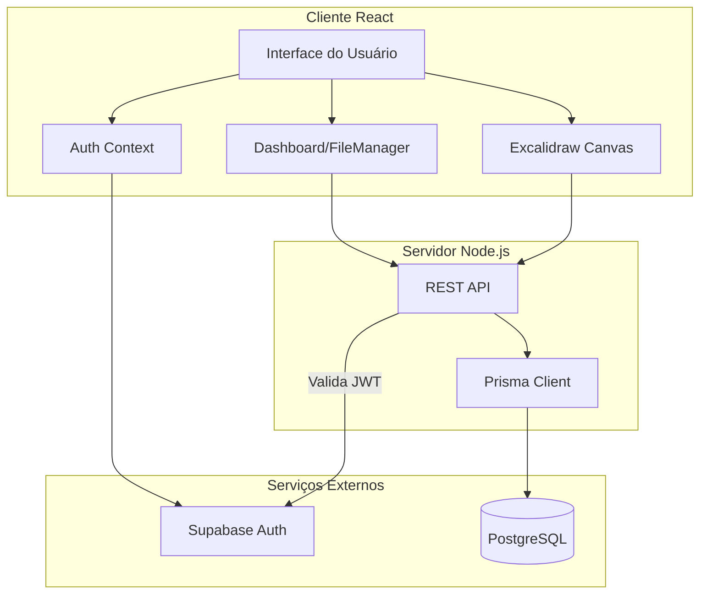
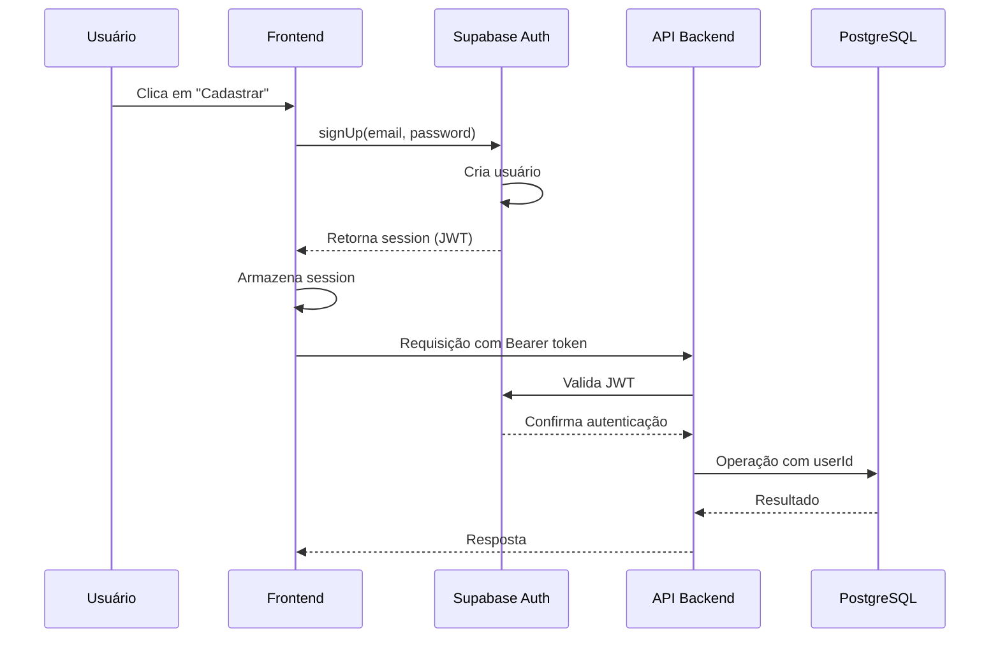
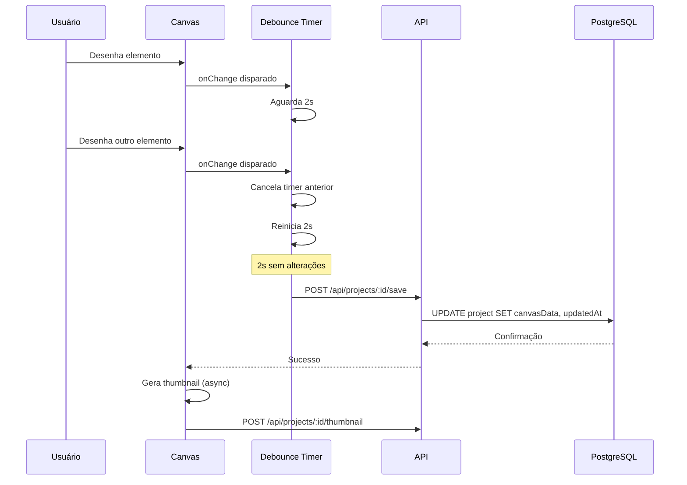
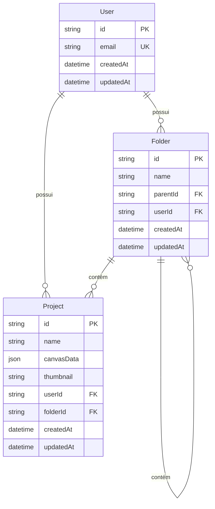

# Documento de Design Técnico

## Clone do Excalidraw com Sistema de Projetos

---

## Visão Geral

Este documento descreve a arquitetura técnica do clone do Excalidraw com sistema de gerenciamento de projetos em nuvem. A aplicação integra o Excalidraw OSS como motor de desenho, adicionando funcionalidades de persistência, organização hierárquica de projetos, e autenticação de usuários.

### Decisões de Design Principais

1. **Excalidraw OSS como componente embutido**: Utilização do pacote `@excalidraw/excalidraw` como biblioteca React, permitindo controle total sobre estado e persistência
2. **Prisma ORM com PostgreSQL**: Abstração de banco de dados com type-safety e migrations automáticas
3. **Supabase Auth**: Serviço de autenticação gerenciado, eliminando a necessidade de implementar criptografia e gestão de sessões
4. **Arquitetura cliente-servidor**: API REST para comunicação entre frontend e backend, com validação JWT em cada requisição

### Tecnologias e Versões

| Tecnologia | Versão | Propósito |
|------------|--------|-----------|
| React | ^18.x | Framework frontend |
| TypeScript | ^5.x | Type safety |
| Excalidraw | ^0.17.x | Motor de desenho |
| Prisma | ^5.x | ORM |
| PostgreSQL | 15+ | Banco de dados |
| Supabase Auth | ^2.x | Autenticação |

---

## Arquitetura

### Diagrama de Alto Nível



### Fluxo de Autenticação



### Fluxo de Auto-Save



---

## Componentes e Interfaces

### Estrutura de Diretórios

```
src/
├── components/
│   ├── canvas/
│   │   ├── ExcalidrawCanvas.tsx    # Wrapper do Excalidraw
│   │   ├── AutoSave.tsx            # Hook de auto-save
│   │   └── ThumbnailGenerator.tsx  # Gerador de thumbnails
│   ├── dashboard/
│   │   ├── Dashboard.tsx           # Container principal
│   │   ├── Sidebar.tsx             # Árvore de pastas
│   │   ├── ProjectGrid.tsx         # Grid de projetos
│   │   ├── FolderTree.tsx          # Componente recursivo de pastas
│   │   └── ProjectCard.tsx         # Card individual de projeto
│   ├── auth/
│   │   ├── LoginForm.tsx           # Formulário de login
│   │   ├── RegisterForm.tsx        # Formulário de cadastro
│   │   └── AuthProvider.tsx        # Context provider
│   └── ui/
│       ├── Button.tsx
│       ├── Modal.tsx
│       └── Input.tsx
├── hooks/
│   ├── useAuth.ts                  # Hook de autenticação
│   ├── useProjects.ts              # CRUD de projetos
│   ├── useFolders.ts               # CRUD de pastas
│   └── useAutoSave.ts              # Lógica de debounce
├── lib/
│   ├── prisma.ts                   # Cliente Prisma (server-side)
│   ├── supabase.ts                 # Cliente Supabase Auth
│   └── api.ts                      # Cliente HTTP
├── pages/
│   ├── _app.tsx
│   ├── index.tsx                   # Dashboard
│   ├── project/[id].tsx            # Editor
│   └── auth/
│       ├── login.tsx
│       └── register.tsx
├── types/
│   └── index.ts                    # Tipos TypeScript
└── styles/
    └── globals.css
```

### Componentes Principais

#### 1. ExcalidrawCanvas

Wrapper do componente Excalidraw com funcionalidades de persistência.

```typescript
interface ExcalidrawCanvasProps {
  projectId: string;
  initialData?: ExcalidrawData;
  onSave: (data: ExcalidrawData) => Promise<void>;
  onThumbnailGenerated: (blob: Blob) => Promise<void>;
}

interface ExcalidrawData {
  elements: readonly ExcalidrawElement[];
  appState: AppState;
  files: BinaryFiles;
}
```

**Responsabilidades:**
- Renderizar o componente Excalidraw
- Gerenciar estado do canvas
- Disparar callbacks de salvamento
- Gerar thumbnails em formato PNG 200x150px

**Integração com Excalidraw OSS:**

```typescript
import { Excalidraw, exportToBlob } from "@excalidraw/excalidraw";

// Exportação para thumbnail
const generateThumbnail = async (elements, appState, files) => {
  const blob = await exportToBlob({
    elements,
    appState: {
      ...appState,
      exportBackground: true,
      viewBackgroundColor: "#ffffff"
    },
    files,
    mimeType: "image/png",
    // Dimensions calculadas para manter aspect ratio 4:3
    getDimensions: (width, height) => ({
      width: 200,
      height: 150,
      scale: Math.min(200 / width, 150 / height)
    })
  });
  return blob;
};
```

#### 2. Dashboard

Container principal do gerenciador de arquivos.

```typescript
interface DashboardProps {
  user: User;
}

interface DashboardState {
  selectedFolderId: string | null;
  viewMode: 'grid' | 'list';
  searchQuery: string;
}
```

**Responsabilidades:**
- Exibir estrutura de pastas na sidebar
- Renderizar grid de projetos
- Gerenciar estado de seleção
- Persistir preferências de visualização

#### 3. FolderTree

Componente recursivo para renderização da hierarquia de pastas.

```typescript
interface FolderTreeProps {
  folder: FolderWithChildren;
  level: number;
  selectedId: string | null;
  onSelect: (folderId: string) => void;
  onExpand: (folderId: string) => void;
  isExpanded: boolean;
}

interface FolderWithChildren {
  id: string;
  name: string;
  children: FolderWithChildren[];
  projects: Project[];
}
```

**Restrições:**
- Máximo de 5 níveis de profundidade (validado no backend)
- Indicação visual de nível através de indentação
- Expansão lazy-load para performance

#### 4. AutoSave Hook

Hook customizado para gerenciar salvamento automático com debounce.

```typescript
interface UseAutoSaveOptions {
  delay: number; // 2000ms padrão
  onSave: (data: ExcalidrawData) => Promise<void>;
  onError: (error: Error) => void;
}

interface UseAutoSaveReturn {
  save: (data: ExcalidrawData) => void;
  isSaving: boolean;
  lastSaved: Date | null;
  error: Error | null;
}
```

**Implementação:**

```typescript
function useAutoSave({ delay = 2000, onSave, onError }: UseAutoSaveOptions): UseAutoSaveReturn {
  const [isSaving, setIsSaving] = useState(false);
  const [lastSaved, setLastSaved] = useState<Date | null>(null);
  const [error, setError] = useState<Error | null>(null);
  const timeoutRef = useRef<NodeJS.Timeout | null>(null);
  const dataRef = useRef<ExcalidrawData | null>(null);

  const save = useCallback((data: ExcalidrawData) => {
    dataRef.current = data;
    
    // Cancela timer anterior
    if (timeoutRef.current) {
      clearTimeout(timeoutRef.current);
    }
    
    // Agenda novo save
    timeoutRef.current = setTimeout(async () => {
      if (!dataRef.current) return;
      
      setIsSaving(true);
      setError(null);
      
      try {
        await onSave(dataRef.current);
        setLastSaved(new Date());
      } catch (err) {
        setError(err as Error);
        onError(err as Error);
      } finally {
        setIsSaving(false);
      }
    }, delay);
  }, [delay, onSave, onError]);

  return { save, isSaving, lastSaved, error };
}
```

#### 5. AuthProvider

Context provider para gerenciamento de estado de autenticação.

```typescript
interface AuthContextValue {
  user: User | null;
  session: Session | null;
  isLoading: boolean;
  signIn: (email: string, password: string) => Promise<void>;
  signUp: (email: string, password: string) => Promise<void>;
  signOut: () => Promise<void>;
}
```

**Integração com Supabase Auth:**

```typescript
import { createClient } from '@supabase/supabase-js';

const supabase = createClient(
  process.env.SUPABASE_URL!,
  process.env.SUPABASE_ANON_KEY!
);

// Login
const signIn = async (email: string, password: string) => {
  const { data, error } = await supabase.auth.signInWithPassword({
    email,
    password,
  });
  if (error) throw error;
  return data;
};

// Cadastro
const signUp = async (email: string, password: string) => {
  const { data, error } = await supabase.auth.signUp({
    email,
    password,
    options: {
      emailRedirectTo: `${window.location.origin}/auth/callback`
    }
  });
  if (error) throw error;
  return data;
};
```

---

## Modelos de Dados

### Schema Prisma

```prisma
generator client {
  provider = "prisma-client-js"
}

datasource db {
  provider = "postgresql"
  url      = env("DATABASE_URL")
}

model User {
  id        String    @id @default(uuid())
  email     String    @unique
  createdAt DateTime  @default(now())
  updatedAt DateTime  @updatedAt
  
  // Relações
  folders   Folder[]
  projects  Project[]
  
  @@map("users")
}

model Folder {
  id        String    @id @default(uuid())
  name      String    @db.VarChar(255)
  createdAt DateTime  @default(now())
  updatedAt DateTime  @updatedAt
  
  // Hierarquia (self-referencing)
  parentId  String?
  parent    Folder?   @relation("FolderHierarchy", fields: [parentId], references: [id], onDelete: Cascade)
  children  Folder[]  @relation("FolderHierarchy")
  
  // Relações
  userId    String
  user      User      @relation(fields: [userId], references: [id], onDelete: Cascade)
  projects  Project[]
  
  // Índices
  @@index([userId])
  @@index([parentId])
  @@index([userId, parentId])
  @@map("folders")
}

model Project {
  id          String    @id @default(uuid())
  name        String    @db.VarChar(255)
  canvasData  Json      // Formato Excalidraw JSON
  thumbnail   String?   @db.Text // Base64 ou URL
  createdAt   DateTime  @default(now())
  updatedAt   DateTime  @updatedAt
  
  // Relações
  userId      String
  user        User      @relation(fields: [userId], references: [id], onDelete: Cascade)
  folderId    String
  folder      Folder    @relation(fields: [folderId], references: [id], onDelete: Cascade)
  
  // Índices
  @@index([userId])
  @@index([folderId])
  @@index([userId, folderId])
  @@index([updatedAt])
  @@map("projects")
}
```

### Diagrama Entidade-Relacionamento



### Validações e Restrições

| Campo | Restrição | Validação |
|-------|-----------|-----------|
| User.email | Único | Formato de email válido (regex) |
| User.id | UUID | Gerado automaticamente |
| Folder.name | max 255 chars | Não vazio após trim |
| Folder.parentId | Opcional | Deve referenciar pasta válida do mesmo usuário |
| Project.name | max 255 chars | Não vazio após trim |
| Project.canvasData | JSON | Schema Excalidraw válido |
| Project.thumbnail | Base64 PNG | Dimensões 200x150px |

### Formato canvasData (Excalidraw JSON)

```json
{
  "type": "excalidraw",
  "version": 2,
  "source": "https://excalidraw.com",
  "elements": [
    {
      "id": "unique-id",
      "type": "rectangle",
      "x": 100,
      "y": 100,
      "width": 200,
      "height": 150,
      "angle": 0,
      "strokeColor": "#1e1e1e",
      "backgroundColor": "transparent",
      "fillStyle": "solid",
      "strokeWidth": 2,
      "strokeStyle": "solid",
      "roughness": 1,
      "opacity": 100,
      "groupIds": [],
      "frameId": null,
      "roundness": null,
      "seed": 12345
    }
  ],
  "appState": {
    "gridSize": 20,
    "viewBackgroundColor": "#ffffff"
  },
  "files": {}
}
```

---

## Correctness Properties

*A property is a characteristic or behavior that should hold true across all valid executions of a system - essentially, a formal statement about what the system should do. Properties serve as the bridge between human-readable specifications and machine-verifiable correctness guarantees.*

Esta seção define propriedades de correção que serão validadas através de testes baseados em propriedades (Property-Based Testing).

As propriedades foram derivadas da análise dos critérios de aceitação, eliminando redundâncias e consolidando comportamentos relacionados em propriedades mais abrangentes.

### Property 1: Round-trip de serialização Excalidraw

*For any* estrutura de dados Excalidraw válida (elements, appState, files), serializar para JSON e deserializar deve produzir uma estrutura equivalente.

**Validates: Requirements 1.3, 1.4, 1.5**

**Rationale:** Cobertura de importação, exportação e compatibilidade de formato em uma única propriedade. Se dados podem ser serializados, armazenados, e restaurados mantendo equivalência, então importação, exportação e compatibilidade estão todas garantidas.

### Property 2: Integridade da hierarquia de pastas

*For any* pasta no sistema, a profundidade da hierarquia não deve exceder 5 níveis ao percorrer a cadeia de parentIds até a raiz.

**Validates: Requirements 3.2**

### Property 3: Isolamento de dados entre usuários

*For any* usuário autenticado e *for any* recurso (projeto ou pasta), se o recurso não pertencer ao usuário, então o acesso deve ser negado com erro 403.

**Validates: Requirements 10.1, 10.2, 10.3, 10.7**

**Rationale:** Consolida todas as formas de isolamento - visualização no dashboard, acesso direto via URL, e filtragem automática de consultas. Todas derivam da mesma propriedade fundamental de propriedade de dados.

### Property 4: Auto-save com debounce

*For any* sequência de alterações no canvas onde múltiplas mudanças ocorrem em intervalos menores que 2 segundos, apenas uma requisição de salvamento deve ser enviada após 2 segundos de inatividade.

**Validates: Requirements 6.1, 6.3**

### Property 5: Exclusão em cascata de pastas

*For any* pasta que seja excluída, todos os projetos e subpastas descendentes devem ser removidos do banco de dados.

**Validates: Requirements 3.4, 10.8**

### Property 6: Geração de thumbnail

*For any* canvas com elementos, a geração de thumbnail deve produzir uma imagem PNG com dimensões de 200x150 pixels que representa visualmente o conteúdo.

**Validates: Requirements 4.2, 4.5**

### Property 7: Validação de movimento de pasta (sem referência circular)

*For any* pasta P e *for any* pasta destino D, se D é descendente de P, então a operação de mover P para D deve ser rejeitada.

**Validates: Requirements 3.5**

### Property 8: Duplicação de projeto

*For any* projeto, ao ser duplicado, o novo projeto deve ter: (1) ID único diferente do original, (2) nome sufixado com "(cópia)", (3) canvasData idêntico, (4) thumbnail idêntico.

**Validates: Requirements 5.3**

### Property 9: Persistência de estado de UI

*For any* estado de interface do Dashboard (pasta selecionada, modo de visualização), após salvar o estado e recarregar a página, o estado deve ser restaurado.

**Validates: Requirements 2.5**

### Property 10: Validação de nomes

*For any* string composta apenas de whitespace, o sistema deve rejeitar como nome de projeto ou pasta.

**Validates: Requirements 5.2, 4.3**

### Property 11: Timestamp de modificação

*For any* projeto ou pasta, após uma operação de modificação (salvar, renomear, mover), o campo updatedAt deve ser maior que o valor anterior.

**Validates: Requirements 3.3, 4.4, 5.4**

### Property 12: Resiliência a falhas de persistência

*For any* operação de salvamento que falhe, o estado local do canvas deve ser preservado e uma indicação de erro deve ser exibida ao usuário.

**Validates: Requirements 5.6, 6.5**

---

## Tratamento de Erros

### Categorias de Erro

| Categoria | Código HTTP | Exemplo | Ação do Sistema |
|-----------|-------------|---------|-----------------|
| Validação | 400 | Nome vazio | Exibir mensagem, manter estado |
| Autenticação | 401 | Token expirado | Redirecionar para login |
| Autorização | 403 | Acesso a projeto alheio | Exibir erro 403 |
| Não encontrado | 404 | Projeto inexistente | Exibir mensagem |
| Conflito | 409 | Nome duplicado | Exibir mensagem |
| Erro interno | 500 | Falha no banco | Exibir erro genérico, tentar novamente |

### Estratégias de Recuperação

1. **Auto-save falho**:
   - Manter dados localmente (localStorage) como backup
   - Exibir indicador visual de erro
   - Tentar novamente automaticamente a cada 10s
   - Permitir salvamento manual

2. **Falha de autenticação**:
   - Redirecionar para login com mensagem explicativa
   - Preservar URL de destino para redirecionamento pós-login

3. **Falha de conexão**:
   - Indicador visual de modo offline
   - Queue de operações pendentes
   - Sincronização automática ao reconectar

### Mensagens de Erro

```typescript
const ERROR_MESSAGES = {
  // Validação
  'VALIDATION.EMPTY_NAME': 'O nome não pode estar vazio',
  'VALIDATION.NAME_TOO_LONG': 'O nome deve ter no máximo 255 caracteres',
  'VALIDATION.INVALID_EMAIL': 'Formato de email inválido',
  'VALIDATION.PASSWORD_TOO_SHORT': 'A senha deve ter no mínimo 8 caracteres',
  
  // Autenticação
  'AUTH.INVALID_CREDENTIALS': 'Email ou senha incorretos',
  'AUTH.EMAIL_IN_USE': 'Este email já está cadastrado',
  'AUTH.SESSION_EXPIRED': 'Sua sessão expirou. Faça login novamente.',
  
  // Autorização
  'AUTH.ACCESS_DENIED': 'Você não tem permissão para acessar este recurso',
  
  // Recursos
  'RESOURCE.NOT_FOUND': 'O recurso solicitado não foi encontrado',
  'RESOURCE.FOLDER_DEPTH_EXCEEDED': 'Limite de 5 níveis de pastas excedido',
  'RESOURCE.CIRCULAR_REFERENCE': 'Não é possível mover uma pasta para dentro de si mesma',
  
  // Sistema
  'SYSTEM.SAVE_FAILED': 'Falha ao salvar. Suas alterações estão salvas localmente.',
  'SYSTEM.CONNECTION_ERROR': 'Erro de conexão. Verifique sua internet.',
};
```

---

## Estratégia de Testes

### Visão Geral

A estratégia de testes combina testes unitários, testes baseados em propriedades (PBT) e testes de integração para garantir cobertura completa.

### Testes Unitários

Testes unitários cobrem casos específicos, edge cases e condições de erro.

**Framework:** Vitest

**Cobertura alvo:** 80%

**Áreas de foco:**
- Validações de entrada (nomes, emails, senhas)
- Lógica de debounce do auto-save
- Geração de thumbnails
- Transformações de dados

### Testes Baseados em Propriedades (PBT)

Testes PBT verificam propriedades universais através de múltiplas entradas geradas aleatoriamente.

**Framework:** fast-check

**Configuração:**
- Mínimo 100 iterações por propriedade
- Seed fixo para reprodutibilidade em CI
- Shrink automático para minimalização de contra-exemplos

**Implementação das Propriedades:**

```typescript
// Property 1: Round-trip de serialização
fc.assert(
  fc.property(
    excalidrawDataArbitrary(),
    (data) => {
      const serialized = JSON.stringify(data);
      const deserialized = JSON.parse(serialized);
      return _.isEqual(data, deserialized);
    }
  ),
  { numRuns: 100 }
);

// Property 2: Integridade de hierarquia
fc.assert(
  fc.property(
    folderHierarchyArbitrary(),
    (folders) => {
      for (const folder of folders) {
        const depth = calculateDepth(folder, folders);
        if (depth > 5) return false;
      }
      return true;
    }
  ),
  { numRuns: 100 }
);

// Property 4: Auto-save debounce
fc.assert(
  fc.property(
    fc.array(excalidrawChangeArbitrary(), { minLength: 2, maxLength: 20 }),
    fc.array(fc.integer({ min: 100, max: 1500 }), { minLength: 2, maxLength: 20 }),
    (changes, intervals) => {
      let saveCount = 0;
      const autoSave = createAutoSave({ delay: 2000, onSave: async () => { saveCount++; } });
      
      // Simula mudanças em intervalos menores que 2s
      for (let i = 0; i < changes.length; i++) {
        autoSave.save(changes[i]);
        clock.tick(intervals[i]);
      }
      
      clock.tick(2000); // Aguarda debounce final
      
      return saveCount === 1; // Apenas um save deve ocorrer
    }
  ),
  { numRuns: 100 }
);
```

### Testes de Integração

Testes de integração verificam fluxos completos com banco de dados real (teste) e serviços mockados.

**Áreas de cobertura:**
- CRUD de projetos com banco de dados
- CRUD de pastas com hierarquia
- Fluxo de autenticação com Supabase mockado
- Auto-save com persistência

**Setup de banco de dados de teste:**
- Banco PostgreSQL dedicado para testes
- Prisma migrate antes de cada suite
- Cleanup entre testes

### Testes E2E

Testes end-to-end verificam jornadas completas do usuário.

**Framework:** Playwright

**Cenários principais:**
1. Cadastro → Login → Criar projeto → Desenhar → Verificar auto-save → Logout
2. Login → Criar hierarquia de pastas → Mover projeto → Excluir pasta
3. Login → Duplicar projeto → Renomear → Verificar isolamento

### Matriz de Testes por Requisito

| Requisito | Unit | PBT | Integration | E2E |
|-----------|------|-----|-------------|-----|
| 1. Integração Excalidraw | ✓ | ✓ | | |
| 2. Dashboard | ✓ | | | ✓ |
| 3. Hierarquia de pastas | ✓ | ✓ | ✓ | ✓ |
| 4. Metadados e thumbnails | ✓ | ✓ | ✓ | |
| 5. CRUD de projetos | ✓ | ✓ | ✓ | ✓ |
| 6. Auto-save | ✓ | ✓ | ✓ | |
| 7. Schema Prisma | | | ✓ | |
| 8. Interface | ✓ | | | ✓ |
| 9. Autenticação | ✓ | | ✓ | ✓ |
| 10. Isolamento de dados | ✓ | ✓ | ✓ | ✓ |

---

## Decisões de Design

### D1: Debounce de Auto-Save em 2 segundos

**Contexto:** Frequência de salvamento automático para balancear persistência e performance.

**Decisão:** Debounce de 2 segundos (2000ms).

**Rationale:**
- Tempo suficiente para usuários digitarem ou desenharem sem interrupções
- Evita requisições excessivas ao servidor
- Reduz carga no banco de dados
- Alinhado com práticas comuns de editores colaborativos

**Alternativas consideradas:**
- 500ms: Muito agressivo, muitas requisições
- 5s: Muito longo, risco de perda de dados em falhas

### D2: Thumbnail em Base64 no Banco

**Contexto:** Armazenamento de imagens miniatura dos projetos.

**Decisão:** Armazenar como string Base64 no campo `thumbnail` do modelo Project.

**Rationale:**
- Thumbnails pequenos (200x150 PNG ~5-15KB)
- Simplifica arquitetura (sem serviço de storage adicional)
- Consultas atômicas (dados e thumbnail juntos)
- Adequado para volumes previstos (< 1000 projetos/usuário)

**Alternativas consideradas:**
- Supabase Storage: Maior complexidade, latência adicional
- Arquivos em disco: Não escalável, problemas de sincronização

**Limitações:**
- Aumenta tamanho do banco
- Não ideal para imagens grandes

### D3: Limite de 5 Níveis de Pastas

**Contexto:** Profundidade máxima da hierarquia de pastas.

**Decisão:** Limitar a 5 níveis de profundidade.

**Rationale:**
- Usabilidade: Hierarquias muito profundas são difíceis de navegar
- Performance: Consultas recursivas ficam custosas
- Simplicidade: Validação straightforward no backend
- Suficiente para maioria dos casos de uso

**Implementação:**
```typescript
async function validateFolderDepth(folderId: string | null, userId: string): Promise<boolean> {
  if (!folderId) return true; // Raiz
  
  let currentId: string | null = folderId;
  let depth = 0;
  
  while (currentId && depth < 5) {
    const folder = await prisma.folder.findFirst({
      where: { id: currentId, userId },
      select: { parentId: true }
    });
    currentId = folder?.parentId ?? null;
    depth++;
  }
  
  return depth < 5;
}
```

### D4: Validação JWT no Backend

**Contexto:** Como garantir que requisições são de usuários autenticados.

**Decisão:** Validar JWT do Supabase em cada requisição protegida.

**Rationale:**
- Stateless: Não requer sessão no servidor
- Seguro: JWT assinado pelo Supabase
- Flexível: Funciona com qualquer cliente

**Implementação:**
```typescript
import { createClient } from '@supabase/supabase-js';

const supabase = createClient(SUPABASE_URL, SUPABASE_JWT_SECRET);

async function authenticateRequest(req: Request): Promise<User> {
  const token = req.headers.authorization?.replace('Bearer ', '');
  
  if (!token) {
    throw new Error('AUTH.NO_TOKEN');
  }
  
  const { data: { user }, error } = await supabase.auth.getUser(token);
  
  if (error || !user) {
    throw new Error('AUTH.INVALID_TOKEN');
  }
  
  return user;
}
```

### D5: HTTP em Desenvolvimento, HTTPS em Produção

**Contexto:** Protocolo de comunicação cliente-servidor.

**Decisão:** Permitir HTTP quando `NODE_ENV=development`, exigir HTTPS quando `NODE_ENV=production`.

**Rationale:**
- Desenvolvimento local não requer certificados SSL
- Facilita testes e debugging
- Produção mantém segurança obrigatória
- Alinhado com boas práticas de segurança

**Implementação:**
- Variável de ambiente `NODE_ENV`
- Middleware que verifica protocolo em produção
- Cookies `secure: true` apenas em produção

---

## Considerações de Segurança

### Autenticação e Autorização

1. **Senhas**: Gerenciadas pelo Supabase Auth com bcrypt/scrypt
2. **JWTs**: Assinados pelo Supabase, validados no backend
3. **Isolamento**: Todas as queries filtradas por `userId`
4. **Sessão**: Refresh automático de tokens

### Proteção de Dados

1. **DATABASE_URL**: Variável de ambiente, nunca exposta ao cliente
2. **Sanitização**: Nomes de pastas/projetos escapados
3. **Validação**: Tipos e tamanhos verificados no backend
4. **CORS**: Configurado para permitir apenas domínios autorizados

### HTTP vs HTTPS

```typescript
// Middleware de segurança
app.use((req, res, next) => {
  if (process.env.NODE_ENV === 'production') {
    if (!req.secure && req.get('x-forwarded-proto') !== 'https') {
      return res.redirect(`https://${req.get('host')}${req.url}`);
    }
  }
  next();
});
```

---

## Referências

- [Excalidraw Documentation](https://docs.excalidraw.com)
- [Excalidraw JSON Schema](https://docs.excalidraw.com/docs/codebase/json-schema)
- [Excalidraw Export Utilities](https://docs.excalidraw.com/docs/@excalidraw/excalidraw/api/utils/export)
- [Prisma Self-Relations](https://prisma.io/docs/concepts/components/prisma-schema/relations/self-relations)
- [Supabase Auth Documentation](https://supabase.com/docs/guides/auth)
- [Supabase Password-based Auth](https://supabase.com/docs/guides/auth/server-side/email-based-auth-with-pkce-flow-for-ssr)

---

## Próximos Passos

Após aprovação deste documento de design, o próximo passo é a criação do documento de tarefas (tasks.md) com a decomposição em tarefas de implementação.
